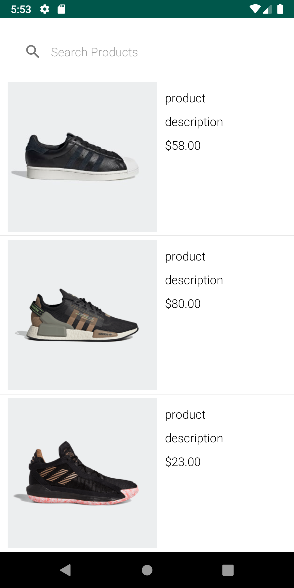
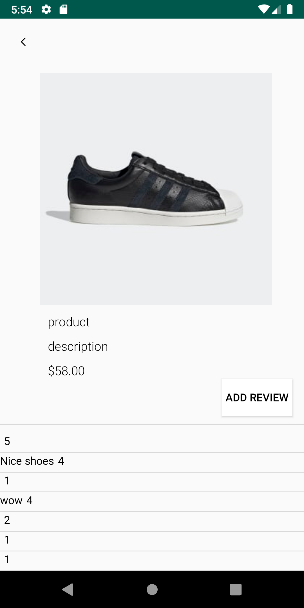
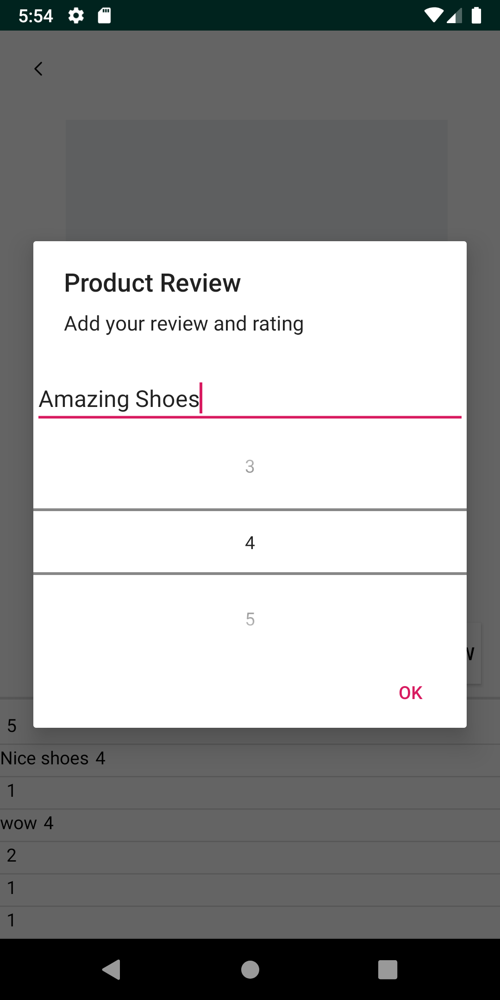
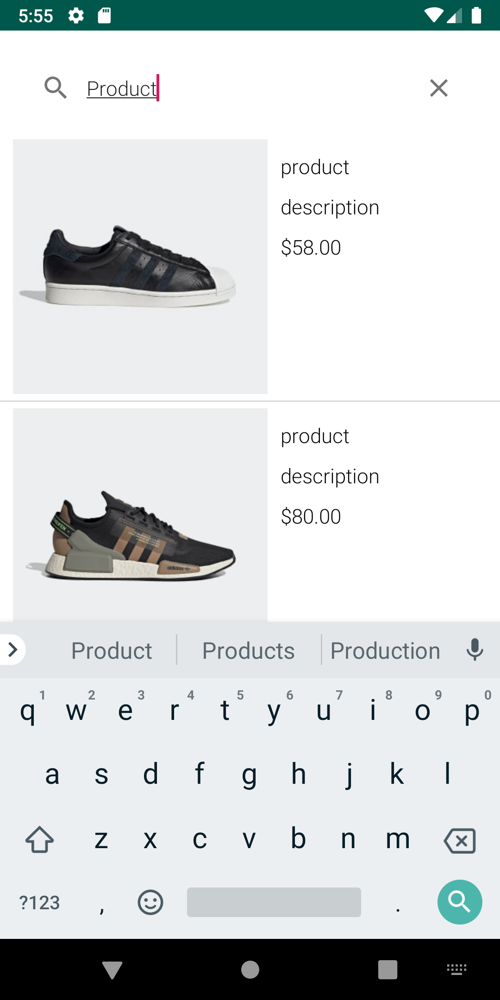

# Adi Challenge

# Karim Maatouk

The code contains the implementation of the AdiChallenge Android App. 

## Author Information    
* Maatouk, Karim (karimmaatouk15@gmail.com) 

Below you can see screenshots from different screens of the app.

**Products Screen**

**Product Details Screen**

**Adding Review**

**Live Search Filter**

Please note that the local API /product returns generic "product" and "description" for all products, therefore, the search functionality is impacted. 

** The API called are local** , thus to successfully run the app, a similar setup must be done through the docker composer, or the baseURL must be changed in the API.kt file. 

